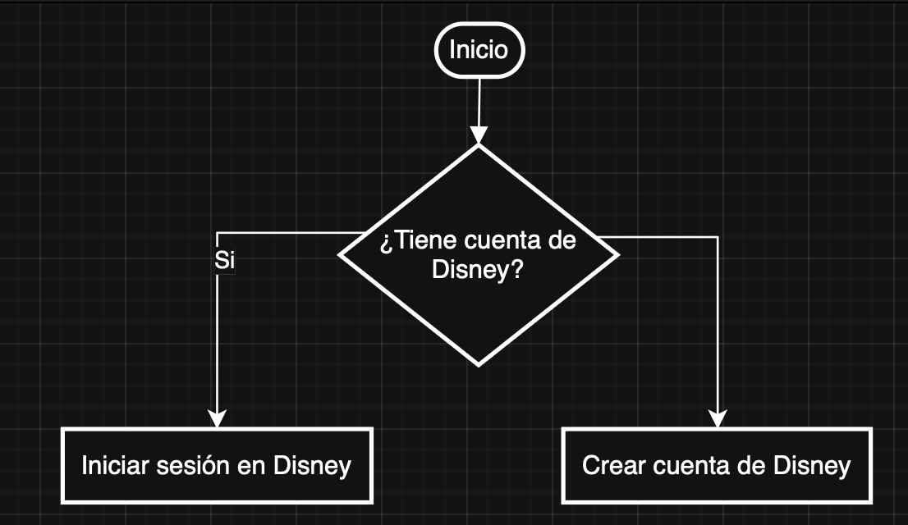
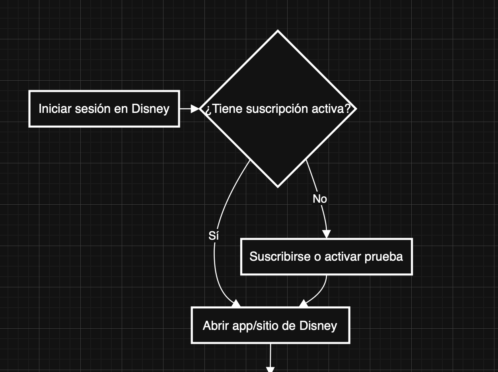
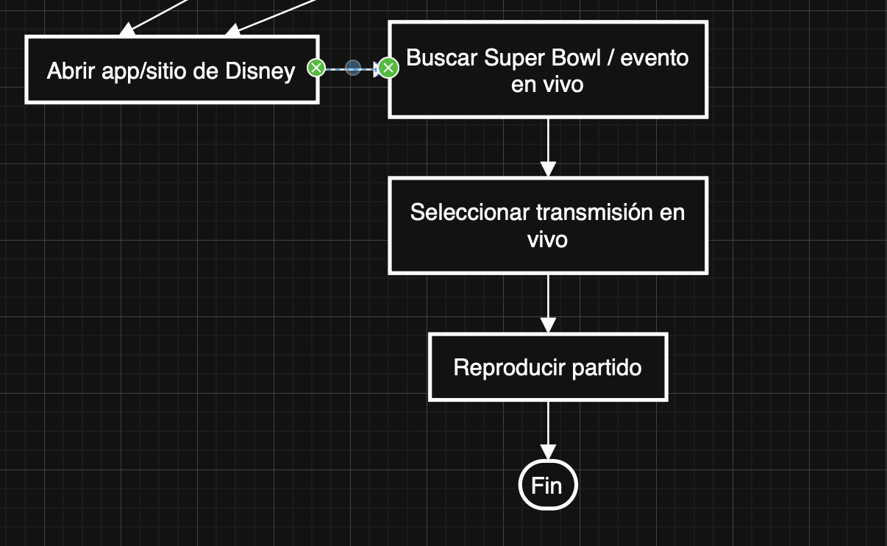

## Algoritmos y Notaciones
Semestre 01, 2026


### Introducción


Un algoritmo es la base de toda solución computacional.  
Permite resolver problemas de forma estructurada y eficiente.


### Algoritmo


Método para resolver un problema mediante una serie de pasos precisos, definidos y finitos.


Deriva de Al-Khwarizmi, considerado el padre de la algoritmia.


Ejemplos: receta de cocina, instrucciones para armar un mueble.


### Propiedades de un algoritmo


**Preciso:** Cada paso claramente definido.


**Definido:** Repetir el algoritmo produce siempre el mismo resultado.


**Finito:** Termina en un número limitado de pasos.


**No ambiguo:** Siempre se sabe qué acción tomar.


**Eficiente:** Idealmente optimiza tiempo y recursos.


### Representaciones


### Narrativa


#### Preparar una taza de té
1. Tomar la tetera
2. Llenarla de agua
3. Encender la estufa
4. Colocar la tetera en la estufa
5. Esperar hasta que el agua hierva
6. Colocar una bolsa de té en una taza
7. Verter el agua hirviendo en la taza
8. Si desea azúcar, añadir 2 cucharaditas
9. Fin


### Diagramas de flujo


Representación gráfica del algoritmo.
Utiliza símbolos para acciones y flechas para indicar flujo.


#### Símbolos estándar
- **Óvalo:** Inicio/Fin
- **Paralelogramo:** Entrada/Salida
- **Rectángulo:** Proceso
- **Rombo:** Decisión
- **Conector:** Puntos de conexión


### Pseudocódigo

Casi código pero no del todo.

```plaintext
Inicio
    Leer num1
    Leer num2
    suma ← num1 + num2
    Escribir suma
Fin


### Ejemplo 

Hagamos un ejemplo de como hubiera sido los pasos para ver el Bad Bunny Bowl en Disney.


Para esto haremos mismo algoritmo en narrativa, pseudocódigo y diagrama de flujo, incluyendo validaciones de cuenta y suscripción.


#### Narrativa

1. Inicio
2. ¿Tiene cuenta de Disney?
   - **No:** Crear cuenta de Disney → ir al paso 3
   - **Sí:** Ir al paso 3
3. Iniciar sesión en Disney
4. ¿Tiene suscripción activa (Disney+)?
   - **No:** Suscribirse o activar período de prueba → ir al paso 5
   - **Sí:** Ir al paso 5


   
5. Abrir la app o sitio web de Disney
6. Buscar "Super Bowl" o el evento en vivo
7. Seleccionar la transmisión en vivo del Super Bowl
8. Reproducir el partido
9. Disfrutar del Super Bowl
10. Fin


#### Pseudocódigo

```plaintext
Inicio
    Escribir "¿Tiene cuenta de Disney? (sí/no)"
    Leer tieneCuentaDisney

    Si tieneCuentaDisney = "no" entonces
        Crear cuenta de Disney
    Fin Si

    Iniciar sesión en Disney

    Escribir "¿Tiene suscripción activa a Disney+? (sí/no)"
    Leer tieneSuscripcion

    Si tieneSuscripcion = "no" entonces
        Suscribirse o activar período de prueba
    Fin Si

    Abrir app o sitio web de Disney
    Buscar "Super Bowl" o evento en vivo
    Seleccionar transmisión en vivo del Super Bowl
    Reproducir partido
    Escribir "Disfrutando del Super Bowl"

Fin
```


#### Diagrama de flujo









